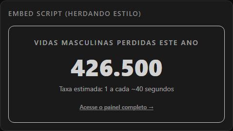
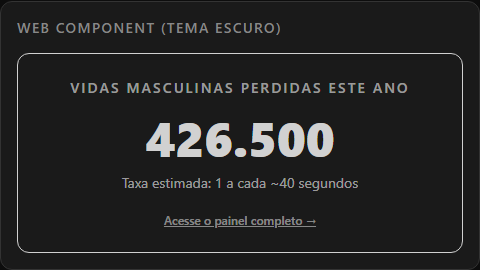
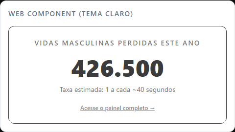

# Vidas Masculinas — Painel de Conscientização e Dados

<p align="center">
  <strong>Uma visualização de dados em tempo real sobre a urgência da mortalidade masculina no Brasil.</strong>
</p>

<p align="center">
  <a href="#sobre-o-projeto">Sobre</a> •
  <a href="#tecnologias">Tecnologias</a> •
  <a href="#metodologia">Metodologia</a> •
  <a href="#como-rodar">Como Rodar</a> •
  <a href="#licença">Licença</a>
</p>

<p align="center">
  <a href="https://vercel.com/new/clone?repository-url=https%3A%2F%2Fgithub.com%2Fagomesthiago%2Foptimistic-oppenheimer">
    
  </a>
  &nbsp;&nbsp;
  <a href="https://www.netlify.com">
    
  </a>
</p>

---

## Sobre o Projeto

Mais de **800.000 homens** morrem por ano no Brasil por diversas causas, representando cerca de 55% de todos os óbitos do país. O **Vidas Masculinas** é uma iniciativa independente e de código aberto (*open-source*), desenvolvida com abordagem *mobile-first* para conscientizar a sociedade, fomentar o debate público e fornecer ferramentas de dados sobre a mortalidade masculina e saúde mental no Brasil.

### Eixos Centrais de Atuação:
* **Mortalidade por Suicídio & Prevenção**: No Brasil, **77,8% das vítimas de suicídio são homens** (com uma razão de 3,5 mortes masculinas para cada feminina). O projeto dedica uma seção exclusiva e um modo de contador em tempo real para dar visibilidade a essa epidemia silenciosa, promovendo o acolhimento gratuito e sigiloso do **CVV 188** e da rede **CAPS/SUS**.
* **Desigualdade na Expectativa de Vida**: Exibição da disparidade de longevidade ao nascer entre homens (**72,0 anos**) e mulheres (**79,0 anos**), registrando um fosso de **7,0 anos a menos para a população masculina** no país (IBGE 2022).
* **Contador em Tempo Real**: Projeção matemática em tempo real com alternância entre óbitos por todas as causas, horário local e suicídios masculinos.
* **Ecossistema de Widgets Incorporáveis**: Distribuição livre de widgets leves (Web Components nativos, Scripts de Embed e API JSON estática) para que portais de notícias, blogs, ONGs e sites institucionais possam incorporar os contadores em suas próprias páginas.
* **Design Premium & Acessibilidade**: Interface minimalista com tema dinâmico (escuro/claro), animações fluidas via GSAP e suporte de acessibilidade.

---

## Tecnologias

O projeto utiliza uma pilha tecnológica moderna e otimizada para web rápida:

* **React 19** & **TypeScript**: Construção de componentes tipados e reativos.
* **Vite**: Bundler ultra-rápido para o ambiente de desenvolvimento e build.
* **Tailwind CSS**: Estilização responsiva e ágil com foco em performance visual.
* **GSAP (GreenSock Animation Platform)**: Micro-animações e transições de interface elegantes.
* **Oxlint**: Linter de altíssima performance para garantir a qualidade estática do código.

---

## Metodologia de Dados

Os dados exibidos na aplicação são projetados com base em informações consolidadas de órgãos públicos federais de saúde e estatística do Brasil:
1. **DATASUS (Sistema de Informações sobre Mortalidade - SIM)** do Ministério da Saúde.
2. **IBGE (Instituto Brasileiro de Geografia e Estatística)**.

O cálculo em tempo real é obtido a partir da média histórica anualizada de óbitos masculinos, convertida para uma taxa fracionada por segundo, permitindo estimar o impacto acumulado ao longo do dia, do ano e do tempo de navegação do usuário.

*Para ler a metodologia completa, consulte a seção dedicada na própria aplicação ou navegue pelo arquivo de utilitários de mortalidade em `src/utils/mortality.ts`.*

---

## Integração via Widgets

O **Vidas Masculinas** foi projetado para ser facilmente incorporado a portais de notícias, blogs, sites de ONGs e páginas institucionais por meio de formatos de integração nativos e leves.

---

### Opção A: Script de Embed Dinâmico
Insere o widget dinamicamente no seu HTML. Herda a fonte e cores do site hospedeiro, oferecendo integração visual nativa.

#### Exemplo de Uso
```html
<div id="vidas-masculinas-widget" data-border="true"></div>
<script type="module" src="https://cdn.jsdelivr.net/gh/agomesthiago/optimistic-oppenheimer@latest/dist/widgets/embed.js" defer></script>
```

#### Pré-visualização
<p align="center">
  
</p>

---

### Opção B: Web Component Nativo
Utiliza Custom Elements para integração limpa e moderna. Herda os estilos globais do site hospedeiro de forma flexível.

#### Exemplo de Uso
```html
<!-- Exemplo em Tema Escuro -->
<vidas-masculinas-counter border="true"></vidas-masculinas-counter>

<!-- Exemplo em Tema Claro -->
<div style="background-color: white; color: black; padding: 1rem;">
  <vidas-masculinas-counter border="true"></vidas-masculinas-counter>
</div>

<script type="module" src="https://cdn.jsdelivr.net/gh/agomesthiago/optimistic-oppenheimer@latest/dist/widgets/web-component.js" defer></script>
```

#### Pré-visualização
<p align="center">
  
  <br>
  
</p>

---

### Opção C: API de Dados (JSON Bruto)
Se você deseja construir seu próprio layout, pode ler diretamente as taxas oficiais de mortalidade projetadas por segundo a partir da nossa API estática hospedada via CDN gratuita:

* **Endpoint JSON**: `https://raw.githubusercontent.com/agomesthiago/optimistic-oppenheimer/master/public/data/mortality-stats.json`

---

### Opção D: Incorporação Simples via Iframe
Caso não queira rodar scripts JavaScript na sua página, pode utilizar a incorporação clássica por iframe:

```html
<iframe 
  src="https://vidasmasculinas.com.br/widget/contador" 
  width="100%" 
  height="420" 
  frameborder="0" 
  scrolling="no" 
  style="border: none; max-width: 480px; overflow: hidden;"
  title="Contador Vidas Masculinas">
</iframe>
```

---

## Licença

Este projeto está sob a licença [MIT](./LICENSE). Sinta-se livre para usar, modificar e distribuir, desde que mantenha os créditos originais.

---

<p align="center">
  <em>Desenvolvido com o propósito de quebrar o silêncio e salvar vidas.</em>
</p>
